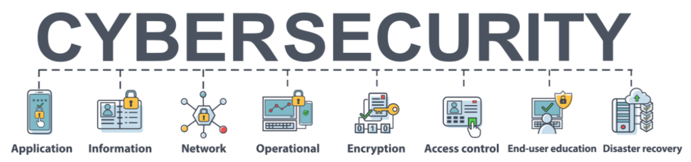

<!---->

  
CISA

  <ul>
    <a href="https://www.cisa.gov/">CISA’s</a> list of <a href="https://www.cisa.gov/free-cybersecurity-services-and-tools">free cybersecurity services and tools</a>.
  </ul>

  
Threat Modeling

  <ul>
    <li><a href="https://shellsharks.com/threat-modeling#vulnerability-catalogs">Threat Modeling Field Guide</a> by Mike Sass</li>
  </ul>

  
Digital Forensics (FREE)

  <ul>
    <li><a href="https://www.sleuthkit.org/">Sleuthkit and Autopsy</a> </li>
    <li><a href="https://www.sleuthkit.org/autopsy/">Autopsy</a> is an easy to use, GUI-based program that allows you to efficiently analyze hard drives and smart phones. It has a plug-in architecture that allows you to find add-on modules or develop custom modules in Java or Python.</li>
    <li><a href="https://www.sleuthkit.org/sleuthkit/">The Sleuth Kit</a> is a collection of command line tools and a C library that allows you to analyze disk images and recover files from them. It is used behind the scenes in Autopsy and many other open source and commercial forensics tools.</li>
  </ul>

  
Intrusion Detection/Prevention Systems (IDS/IPS) tools

  <ul>
    <li><a href="https://zeek.org/">Zeek</a> An Open Source Network Security Monitoring Tool</li>
    <li><a href="https://suricata.io/">Suricata</a> is a high performance, open source network analysis and threat detection software that includes IDS Alerts, Protocol transactions, Network flows, PCAP Recordings, and Extracted files.</li>
    <li><a href="https://www.kismetwireless.net/">Kismet</a> is a sniffer, WIDS, and wardriving tool for Wi-Fi, Bluetooth, Zigbee, RF, and more, which runs on Linux and macOS</li>
    <li><a href="https://www.snort.org/">Snort</a> is an Open Source Intrusion Prevention System (IPS) in the world. Snort IPS uses a series of rules that help define malicious network activity and uses those rules to find packets that match against them and generates alerts for users. </li>
    <li><a href="https://github.com/quadrantsec/sagan">Sagan</a> is a multi-threads, high performance log analysis engine. At it's core, Sagan similar to Suricata/Snort but with logs rather than network packets.</li>
  </ul>

  
Endpoint detection and response (EDR) tools

  <ul>
    <li><a href="https://www.openedr.com/">OpenEDR</a> is an open source endpoint detection and response platform that provides analytic detection with Mitre ATT&CK visibility for event correlation and root cause analysis of adversarial cyber threat activity and behaviors in real time.</li>
    <li><a href="https://www.bitdefender.com/business/enterprise-products/endpoint-detection-response.html">Bitdefender</a> Endpoint Detection and Response</li>
    <li><a href="https://www.fortinet.com/products/endpoint-security/fortiedr">FortiEDR</a> </li>
  </ul>

  
Security Information and Event Management (SIEM) tools

  <ul>
    <li><a href="https://cybersecurity.att.com/products/ossim">AlienVault® OSSIM</a> is a feature-rich, open-source security information and event management (SIEM) that includes event collection, normalization, and correlation.</li>
    <li><a href="https://chronicle.security/">Chronicle</a> A modern security operations platform to defend against modern threats. Say goodbye to legacy SIEMs.</li>
    <li><a href="https://www.elastic.co/security/siem">Elastic</a> Detect, investigate, and respond to evolving threats. Harness data at cloud speed and scale. Heighten host visibility and control. Modernize security with a unified, open SIEM solution.</li>
    <li><a href="https://www.exabeam.com/product/siem/">Exabeam</a> Cloud-native SIEM at hyperscale with fast, modern search and powerful correlation, reporting, dashboarding, and case management.</li>
    <li><a href="https://www.ibm.com/products/qradar-siem">IBM QRadar® Security Intelligence Platform</a> SIEM applies machine learning and user behavior analytics to network traffic alongside traditional logs, providing analysts with more accurate, contextualized and prioritized alerts.</li>
    <li><a href="https://logrhythm.com/solutions/security/siem/">LogRhythm</li>
    <li><a href="https://www.splunk.com/en_us/products.html">Splunk</a> Detect, investigate and respond faster with Splunk’s Unified Security and Observability Platform.</li>
  </ul>

  
OSINT / Reconnaissance

  <ul>
    <li><a href="https://www.abuseipdb.com">AbuseIPDB</a> - Check IP address, domain name or subnet.</li>
    <li><a href="https://www.arin.net/">American Registry for Internet Numbers (ARIN)</a> - Nonprofit, member-based organization that administers IP addresses and ASNs in support of the operation and growth of the Internet.</li>
    <li><a href="http://www.betterwhois.com/">Better Whois</a> - The whois domain search that works with all registrars.</li>
    <li><a href="https://app.w2s2.com/certdb">CertDB</a> - A searcheable database of the internet’s SSL/TLS certificate names.</li>
    <li><a href="https://www.crunchbase.com/#/home/index">Crunchbase</a> - Discover innovative companies and the people behind them.</li>
    <li><a href="https://cylect.io/project-anthony-ultimate-osint-tool">Cylect.io</a> - Ultimate OSINT searching tool.</li>
    <li><a href="https://www.databreaches.net/">DataBreaches.net</a> - Information on corporate security breaches.</li>
    <li><a href="https://www.dehashed.com">Dehashed</a> - Data-mining and deep web asset search engine.</li>
    <li><a href="https://discordservers.com">Discord Servers</a> - Discord server search.</li>
    <li><a href="http://whois.domaintools.com/">DomainTools</a> - Whois lookup, domain availability and IP search tools.</li>
    <li><a href="https://dorkgenius.com">DorkGenius</a> - Generate custom dorks for Google, Bing, DuckDuckGo, and more!</li>
    <li><a href="https://dorksearch.com">DorkSearch.com</a> - Faster Google Dorking.</li>
    <li><a href="https://dnsdumpster.com/">DNSDumpster</a> - DNS recon and research, find and lookup dns records.</li>
    <li><a href="https://dnsviz.net">DNSViz</a> - Tool for visualizing the status of a DNS zone.</li>
    <li><a href="http://www.dnsqueries.com/en/">dnsqueries.com</a> - Collection of online network tools.</li>
    <li><a href="https://findadiscord.com">Find a Discord</a> - Discord server search.</li>
    <li><a href="https://en.fofa.info">FOFA</a> - Search engine for global cyberspace mapping.</li>
    <li><a href="http://www.googleguide.com/advanced_operators_reference">Google Advanced Search Operators</a> - A resource for doing advanced Google searches.</li>
    <li><a href="https://grep.app">grep.app</a> - Search across a half million git repos.</li>
    <li><a href="http://www.gsaelibrary.gsa.gov/ElibMain/home.do">GSA eLibrary</a> - Source for the latest GSA contract award information.</li>
    <li><a href="https://haveibeensquatted.com">Have I Been Squatted?</a> - Check if your domain has been squatted.</li>
    <li><a href="https://hunter.io">Hunter</a> - Search for professional email addresses.</li>
    <li><a href="https://hunter.how">Hunter.how</a></li>
    <li><a href="http://bgp.he.net/">Hurricane Electric BGP Toolkit</a></li>
    <li><a href="https://intelx.io">IntelligenceX</a> - Search Tor, I2P, data leaks, domains, and emails.</li>
    <li><a href="https://ipspy.net">IPSpy.net</a></li>
    <li><a href="https://leakix.net">LeakIX</a> - Search publicly indexed information.</li>
    <li><a href="http://www.lexisnexis.com/hottopics/lnacademic/">LexisNexis® Academic and Library Solutions</a> - Search tool for academic documents.</li>
    <li><a href="https://lyzem.com">Lyzem</a> - Telegram search engine.</li>
    <li><a href="https://ipinfo.io/tools/map">Map IPs</a> - Paste up to 500,000 IPs below to see where they’re located on a map.</li>
    <li><a href="https://check.merox.io">merox.io</a> - DNS security and DMARC</li>
    <li><a href="https://metaosint.github.io">MetaOSINT</a> - Aggregation of “top” tools and resources intended to help jumpstart OSINT investigations.</li>
    <li><a href="http://mxtoolbox.com/">MX Lookup Tool</a> - Check your DNS MX records online.</li>
    <li><a href="http://www.netcraft.com/">Netcraft</a> - Collection of internet security services.</li>
    <li><a href="https://www.networksolutions.com/whois/index-res.jsp?bookmarked=27eef1785724b4361c829122ae0f.059">Network Solutions</a> - Whois lookup for domain registration information.</li>
    <li><a href="https://nmap.org/">Nmap</a> "Network Mapper" (KALI) (FREE) is a free and open source utility for network discovery and security auditing.</li>
    <li><a href="https://networkscan.monster">NetworkScan</a> - IP Lookups for Open Ports</li>
    <li><a href="http://network-tools.com/nslook/">NsLookup</a> - Online tool for querying DNS servers.</li>
    <li><a href="http://networking.ringofsaturn.com/Tools/whois.php">Online Whois Tool</a></li>
    <li><a href="https://osintframework.com">OSINT Framework</a></li>
    <li><a href="https://osint.industries">OSINT Industries</a> - Gateway to email-based research.</li>
    <li><a href="https://pastebin.com">Pastebin</a></li>
    <li><a href="https://start.me/p/0PgzqO/photo-osint">Photo OSINT</a></li>
    <li><a href="https://publicwww.com">PublicWWW</a> - Find any alphanumeric snippet, signature or keyword in the web pages HTML, JS and CSS code.</li>
    <li><a href="https://ransomwhe.re">Ransomwhere</a> - Open, crowdsourced ransomware payment tracker.</li>
    <li><a href="https://www.ripe.net/">RIPE Network Coordination Centre</a> - Organization that allocates and registers blocks of Internet number resources to ISPs and other organizations.</li>
    <li><a href="https://searchcode.com">searchcode</a> - Search 75 billion lines of code from 40 million projects.</li>
    <li><a href="http://www.sec.gov/edgar.shtml">SEC eFilings (EDGAR)</a> - Electronic Data Gathering, Analysis and Retrieval system.</li>
    <li><a href="https://snusbase.com">SnusBase</a> - Data breach search engine.</li>
    <li><a href="https://www.subdomain.center">Subdomain Center</a></li>
    <li><a href="https://tgstat.ru/en">TGStat</a> - Telegram search channel</li>
    <li><a href="https://web.archive.org">Wayback Machine</a> - The archive for the Internet and a time machine for the web.</li>
    <li><a href="https://whatsmyname.app">WhatsMyName</a> - Enumerate usernames across many websites</li>
    <li><a href="http://www.whatsmyip.org/">What’s My IP Address?</a> - A number of interesting tools including port scanners, traceroute, ping, whois, DNS, IP identification and more.</li>
    <li><a href="https://who.is/">who.is</a> - Whois search, domain name, website and IP tools.</li>
    <li><a href="https://www.wigle.net">Wigle.net</a> - Database of wireless networks.</li>
    <li><a href="https://www.wireshark.org/">Wireshark</a> (KALI) (FREE) is a network protocol analyzer tool to locate, identify and examine network packets to diagnose critical issues and spot security weaknesses. </li>
    <li><a href="https://cipher387.github.io/osintmap/">Worldwide OSINT tools map</a> - Phonebooks, cadastral maps, vehicle numbers databases, business registries, passengers lists, court records and much more.</li>
    <li><a href="https://www.zoomeye.org">ZoomEye</a> - Target information search.</li>
  </ul>

  
Scanning / Enumeration

  <ul>
    <li><a href="https://github.com/edoardottt/cariddi">Cariddi</a> - Take a list of domains, crawl urls and scan for endpoints, secrets, api keys, file extensions, tokens and more</li>
    <li><a href="https://search.censys.io">Censys Search</a> - Search IP address, name, protocol or field.</li>
    <li><a href="https://gpt.censys.io">CensysGPT Beta</a> - CensysGPT beta simplifies building queries and empowers users to conduct efficient and effective reconnaissance operations.</li>
    <li><a href="https://www.criminalip.io">CriminalIP</a> - Search for information about assets connected to the public Internet.</li>
    <li><a href="https://crt.sh">crt.sh</a> - Certificate search.</li>
    <li><a href="https://crxcavator.io/">CRXcavator</a> - Chrome extension scanning.</li>
    <li><a href="https://app.docguard.io">DocGuard</a></li>
    <li><a href="https://fullhunt.io">FullHunt</a> - Attack Surface Enumerator.</li>
    <li><a href="https://viz.greynoise.io">GreyNoise</a> - Internet-connected devices.</li>
    <li><a href="https://kamerka.io">ꓘamerka</a> and <a href="https://lite.kamerka.io">ꓘamerka lite</a> - Public ICS identification</li>
    <li><a href="https://mxtoolbox.com">MX Toolbox</a></li>
    <li><a href="https://app.netlas.io/responses/">Netlas</a> - Search and monitor internet connected assets.</li>
    <li><a href="https://securityheaders.com">Security Headers | Probely</a> - Analyze HTTP headers.</li>
    <li><a href="https://securitytrails.com">SecurityTrails</a> - Attack surface scanning.</li>
    <li><a href="https://www.shodan.io/">Shodan</a> - Search engine for internet-connected devices.</li>
    <li><a href="https://internetdb.shodan.io">Shodan | InternetDB</a> - Fast way to see the open ports for an IP address.</li>
    <li><a href="https://www.sslshopper.com/ssl-checker.html">SSL Checker</a> - SSL certificate verification.</li>
    <li><a href="https://www.ssllabs.com/ssltest/">SSL Server Test</a> - Tool from Qualys to perform deep analysis of the configuration of an SSL web server.</li>
    <li><a href="https://urlscan.io">urlscan.io</a> is a free service that scans and analyzes URLs and provides a detailed report summarizing the URL information.</li>
    <li><a href="https://www.wappalyzer.com">Wappalyzer</a> - Identify technologies on websites.</li>
    <li><a href="https://openvas.org/">OpenVAS</a> (FREE) is a full-featured vulnerability scanner with internal programming language for customization and updated content from developer's feed.</li>
    <li><a href="https://cirt.net/Nikto2">Nikto</a> (KALI) (FREE) is an Open Source (GPL) web server scanner which performs comprehensive tests against web servers for dangerous/outdated files/programs, server configuration and identification.</li>
    <li><a href="https://github.com/projectdiscovery/nuclei">Nuclei</a> - Fast and customizable vulnerability scanner based on simple YAML based DSL.</li>
    <li><a href="https://portswigger.net/burp/communitydownload">Burp Community</a> (FREE) is the free version of a paid toolset that includes some great tools (web crawling, Repeater, Decoder, Sequencer, and Comparer).</li>
    <li><a href="https://www.ossec.net/">OSSEC</a> (FREE) is a scalable, multi-platform, open source, free Host-based Intrusion Detection System (HIDS).</li>
    <li><a href="https://wapiti-scanner.github.io/">Wapti</a> - The web-application vulnerability scanner</li>
  </ul>

  
Phishing

  <ul>
    <li><a href="https://www.expireddomains.net/deleted-domains/">ExpiredDomains.net</a> - Expired domain name search engine.</li>
    <li><a href="https://www.kitploit.com/">Kidploit</a> - PenTest & Hacking Tools for WINDOWS, LINUX, MACOS, ANDROID, IPHONE, SQLI, and OTHERS</li>
    <li><a href="https://phish.ly">phish.ly</a> - Analyze suspicious emails with Tines and urlscan</li>
    <li><a href="https://getgophish.com/">Gophish</a> (FREE) is a powerful, easy-to-use, open-source phishing toolkit meant to help pentesters and businesses conduct real-world phishing simulations.</li>
  </ul>

  
Exploits

  <ul>
    <li><a href="https://www.bugbountyhunting.com/">Bug Bounty Hunting Search Engine</a> - Search for writeups, payloads, bug bounty tips, and more…</li>
    <li><a href="https://evasions.checkpoint.com/">CP-R Evasion Techniques</a></li>
    <li><a href="https://cvexploits.io">CVExploits</a> - Comprehensive database for CVE exploits.</li>
    <li><a href="https://sygnialabs.github.io/DROPS/">DROPS</a> - Dynamic CheatSheet/Command Generator</li>
    <li><a href="https://exploit-notes.hdks.org">Exploit Notes</a> - Hacking techniques and tools for penetration testings, bug bounty, CTFs.</li>
    <li><a href="https://www.exploit-db.com/">ExploitDB</a> - Huge repository of exploits from Offensive Security.</li>
    <li><a href="https://files.ninja">files.ninja</a> - Upload any file and find similar files.</li>
    <li><a href="https://www.exploit-db.com/google-hacking-database/">Google Hacking Database (GHDB)</a> - A list of Google search queries used in the OSINT phase of penetration testing.</li>
    <li><a href="https://gtfoargs.github.io">GTFOArgs</a> - Curated list of Unix binaries that can be manipulated for argument injection</li>
    <li><a href="https://gtfobins.github.io">GTFOBins</a> - Curated list of Unix binaries that can be used to bypass local security restrictions in misconfigured systems.</li>
    <li><a href="https://hijacklibs.net">Hijack Libs</a> - Curated list of DLL Hijacking candidates.</li>
    <li><a href="https://www.kitploit.com/">Kidploit</a> - PenTest & Hacking Tools for WINDOWS, LINUX, MACOS, ANDROID, IPHONE, SQLI, and OTHERS</li>
    <li><a href="https://lots-project.com">Living Off Trusted Sites (LOTS) Project</a> - Repository of popular, legitimate domains that can be used to conduct phishing, C2, exfiltration and tool downloading while evading detection.</li>
    <li><a href="https://lofl-project.github.io">LOFLCAB</a> - Living off the Foreign Land Cmdlets and Binaries</li>
    <li><a href="https://lolbas-project.github.io">LOLBAS</a> - Curated list of Windows binaries that can be used to bypass local security restrictions in misconfigured systems.</li>
    <li><a href="https://www.loobins.io">LOOBins</a> <a href="https://github.com/infosecB/LOOBins">
        <i class="fab fa-github"></i>
    </a> - Living Off the Orchard: macOS Binaries (LOOBins) is designed to provide detailed information on various built-in macOS binaries and how they can be used by threat actors for malicious purposes.</li>
    <li><a href="https://sploitus.com/">SPLOITUS</a> - Exploit search database.</li>
    <li><a href="http://xssed.com/">XSSed</a> - Information on and an archive of Cross-Site-Scripting (XSS) attacks.</li>
  </ul>

  
Password

  <ul>
    <li><a href="https://haveibeenpwned.com/">Have I been pwned?</a> - Check if you have an account that has been compromised in a data breach.</li>
    <li><a href="https://www.grc.com/passwords.htm">Ultra High Security Password Generator</a> - Generate long, high-quality, random passwords.</li>
    <li><a href="https://hashcat.net/hashcat/">HashCat</a> - Advanced Password Recovery</li>
    <li><a href="https://www.kitploit.com/">Kidploit</a> - PenTest & Hacking Tools for WINDOWS, LINUX, MACOS, ANDROID, IPHONE, SQLI, and OTHERS</li>
    <li><a href="https://www.openwall.com/john/">John the Ripper</a> - password cracker</li>
    <li><a href="https://ophcrack.sourceforge.io/">Ophcrack</a> is a free Windows password cracker based on rainbow tables. </li>
    <li><a href="https://sourceforge.net/projects/thc-hydra.mirror/">THC Hydra</a> Multi Protocol Password Hack also at <a href="https://github.com/vanhauser-thc/thc-hydra">git</a>.</li>
  </ul>

  
Vulnerability Catalogs and Tools

  <ul>
    <li><a href="https://shellsharks.com/threat-modeling#vulnerability-catalogs">Vulnerability Catalogs</a></li>
    <li><a href="https://atlas.mitre.org">ATLAS</a></li>
    <li><a href="https://attack.mitre.org">ATT&amp;CK</a></li>
    <li><a href="https://bugtraq.securityfocus.com/archive">BugTraq</a> - formerly <a href="http://www.securityfocus.com/bid/">SecurityFocus</a></li>
    <li><a href="https://www.cisa.gov/uscert/ncas/alerts">CISA Alerts</a> - Providing information on current security issues, vulnerabilities and exploits.</li>
    <li><a href="https://cpr-zero.checkpoint.com">CPR-Zero</a> - Check Point Research Vulnerability Repository</li>
    <li><a href="http://cve.mitre.org/">CVE - Common Vulnerabilities and Exposures (CVE)</a> and <a href="https://www.cve.org/">cve.org</a> - CVE respository from MITRE.</li>
    <li><a href="https://web.nvd.nist.gov/view/vuln/search?execution=e2s1">CVE Search</a> - National Vulnerability Database.</li>
    <li><a href="https://cvetrends.com/">CVE Trends</a> - crowdsourced CVE intel.</li>
    <li><a href="https://nvd.nist.gov/CVSS-v2-Calculator">CVSS Version 2 Calculator</a> - Calculate CVSS risk scores.</li>
    <li><a href="/designer-vulnerabilities#title">Designer Vulnerabilities | Shellsharks</a> - Named vulnerabilities.</li>
    <li><a href="https://inthewild.io/feed">inTheWild</a> - A database of actively exploited vulnerabilities.</li>
    <li><a href="http://www.tenable.com/plugins/?view=search">Nessus Plugin Search</a> - A search tool for Nessus plugins.</li>
    <li><a href="https://osv.dev">OSV | Open Source Vulnerabilities</a> - Vulnerability database for open source projects.</li>
    <li><a href="https://packetstormsecurity.com">Packet Storm</a></li>
    <li><a href="https://vulners.com">Vulners</a> - Search engine for security intelligence.</li>
    <li><a href="https://www.wordfence.com/threat-intel/">Wordfence Intelligence</a> - Threat intelligence data platform which currently consists of an incredibly comprehensive database of WordPress vulnerabilities.</li>
  </ul>

  
Red Team

  <ul>
    <li><a href="https://atomicredteam.io/atomics/">Atomic Red Team</a></li>
    <li><a href="https://www.thec2matrix.com/matrix">C2 Matrix</a></li>
    <li><a href="https://www.kitploit.com/">Kidploit</a> - PenTest & Hacking Tools for WINDOWS, LINUX, MACOS, ANDROID, IPHONE, SQLI, and OTHERS</li>
    <li><a href="https://www.loldrivers.io">Living Off The Land Drivers</a> - Curated list of Windows drivers used by adversaries to bypass security controls and carry out attacks.</li>
    <li><a href="https://unprotect.it">Unprotect Project</a> - Search Evasion Techniques.</li>
    <li><a href="https://wadcoms.github.io">WADComs</a> - Curated list of offensive security tools and their respective commands, to be used against Windows/AD environments.</li>
    <li><a href="https://www.aircrack-ng.org/">Aircrack-ng</a> (KALI) (FREE) is a complete suite of tools focusing on monitoring, attacking, testing, and cracking your Wi-Fi network.</li>
    <li><a href="https://sqlmap.org/">Sqlmap</a> (KALI) (FREE) is an open source penetration testing tool that automates the process of detecting and exploiting SQL injection flaws and taking over of database servers. </li>
    <li><a href="https://www.zaproxy.org/">ZAP</a> (FREE) is an open source penetration testing tool designed specifically for testing web applications.</li>
    <li><a href="https://lcamtuf.coredump.cx/p0f3/">P0f</a> (FREE) (STEALTH) is a steath tool using passive traffic fingerprinting to identify OS and software on both endpoints, measurement of system uptime and network topology, automated detection of connection sharing, load balancing, and proxying setups, and detection of clients and servers that forge declarative statements such as X-Mailer or User-Agent.</li>
    <li><a href="https://www.kali.org/">Kali Linux</a> (FREE) is a Debian Linux derivative specifically designed toward testing for security tasks, such as penetration testing, security auditing and digital forensics. Kali includes roughly 600 pre-installed [tools](https://www.kali.org/tools/all-tools/).</li>
    <li><a href="https://www.metasploit.com/">The Metasploit Framework (MSF)</a> (KALI) (FREE) is a collection of exploits–it and security auditing tools. </li>
    <li><a href="https://hashcat.net/hashcat/">HashCat</a> - Advanced Password Recovery</li>
    <li><a href="https://www.openwall.com/john/">John the Ripper</a> - password cracker</li>
    <li><a href="https://ophcrack.sourceforge.io/">Ophcrack</a> is a free Windows password cracker based on rainbow tables.</li>
    <li><a href="https://sourceforge.net/projects/thc-hydra.mirror/">THC Hydra</a> Multi Protocol Password Hack also at <a href="https://github.com/vanhauser-thc/thc-hydra">git</a>.</li>
  </ul>

  
>Malware Analysis / Investigation / Intelligence / Forensics

  <ul>
    <li><a href="https://otx.alienvault.com">Alien Vault OTX</a> - Open threat intelligence community.</li>
    <li><a href="https://www.binaryedge.io">Binary Edge</a> - Real-time threat intelligence streams.</li>
    <li><a href="https://capesandbox.com/analysis/">CAPE Sandbox</a> is an open source service used to automate the analysis of suspicious files. Using an isolated environment, malicious files such as malware are analyzed and a comprehensive report outlines the malware behavior.</li>
    <li><a href="https://godbolt.org/">Compiler Explorer</a> - Emulated compilation environment for a variety of assembly languages.</li>
    <li><a href="https://controlcompass.github.io/">Control Validation Compass</a> - Threat modeling aide and purple team content repository.</li>
    <li><a href="https://gchq.github.io/CyberChef/">CyberChef</a> - The cyber swiss army knife.</li>
    <li><a href="https://cyberowl.org">CyberOwl</a> - Stay informed on the latest cyber threats.</li>
    <li><a href="https://dfiq.org">DFIQ</a> - Digital Forensics Investigative Questions and the approaches to answering them.</li>
    <li><a href="https://www.echotrail.io/">EchoTrail</a> - Threat hunting resource used to search for a Windows filename or hash.</li>
    <li><a href="https://eml-analyzer.herokuapp.com">EML analyzer</a> - Heroku-ified, online instance of <a href="https://github.com/ninoseki/eml_analyzer">EML analyzer</a>.</li>
    <li><a href="https://filesec.io">filesec.io</a> - Latest file extensions being used by attackers.</li>
    <li><a href="http://www.getghiro.org">Ghiro</a> - Forensic analysis</li>
    <li><a href="https://labs.inquest.net">InQuest Labs</a> - Indicator Lookup.</li>
    <li><a href="https://intel.taggartinstitute.org/">intel.taggartinstitute.org</a> - RSS feed of infosec intel</li>
    <li><a href="https://virusscan.jotti.org/">Jotti</a> malware scan is a free service that lets you scan suspicious files with several antivirus programs. There are some limitations to the number of files that you can submit.</li>
    <li><a href="https://malapi.io">MalAPI.io</a> - MalAPI.io maps <a href="https://docs.microsoft.com/en-us/windows/win32/apiindex/windows-api-list">Windows APIs</a> to common techniques used by malware.</li>
    <li><a href="https://bazaar.abuse.ch">Malware Bazaar</a> is a free repository for malware samples. Malware samples are a great source of threat intelligence that can be used for research purposes.</li>
    <li><a href="https://malware.rip">Malware.rip</a> - Open documents from untrustworthy websites or users.</li>
    <li><a href="https://www.malware-traffic-analysis.net/">Malware-Traffic-Analysis.net</a> - A source for pcap files and malware samples.</li>
    <li><a href="https://www.onyphe.io">Onyphe</a> - Cyber defense search engine.</li>
    <li><a href="https://orkl.eu">ORKL</a> - Library of collective past achievements in the realm of CTI reporting.</li>
    <li><a href="https://pulsedive.com">Pulsedive</a> - Threat intelligence.</li>
    <li><a href="https://emailrep.io">Simple Email Reputation</a> - Checks reputation for emails.</li>
    <li><a href="https://threatbook.io">ThreatBook TI</a> - Search for IP address, domain.</li>
    <li><a href="http://urlquery.net/">urlquery.net</a> - Free URL scanner that performs analysis for web-based malware.</li>
    <li><a href="https://www.vergiliusproject.com/">VERGILIUS</a> - Take a look into the depths of Windows kernels and reveal more than 60000 undocumented structures.</li>
    <li><a href="https://www.virustotal.com/">VirusTotal</a> - Analyze suspicious files and URLs to detect malware.</li>
    <li><a href="https://wtfbins.wtf">WTFBINS</a> - Catalog benign applications that exhibit suspicious behavior.</li>
    <li><a href="https://yaradbg.dev">YaraDbg</a> - Web-based Yara debugger to help security analysts to write hunting or detection rules.</li>
    <li><a href="https://docs.remnux.org/">REMnux</a> (FREE) a Linux toolkit for reverse-engineering and analyzing malicious software. ></li>
  </ul>

  
>Ransomware

  <ul>
    <li><a href="https://www.comparitech.com/blog/information-security/global-ransomware-attacks/">Map of worldwide ransomware attacks</a></li>
    <li><a href="https://www.ransomlook.io">RansomLook</a> is a ransomware leak site monitoring tool.</li>
    <li><a href="https://ransomware.live">Ransomware.live</a> is a ransomware leak site monitoring tool. It will scrape all of the entries on various ransomware leak sites and published them here.</li>
    <li><a href="https://rcxmatrix.org">Ransomeware Control Matrix</a> - Cybersecurity framework designed to help organizations defend against ransomware attacks by providing a comprehensive set of controls that can be implemented to reduce the risk of such attacks.<li></li>
  </ul>

  
>Cloud

  <ul>
    <li><a href="https://buckets.grayhatwarfare.com">Grayhat Warfare</a> - Public Bucket Finder</li>
    <li><a href="https://osint.sh/buckets/">OSINT.SH Public Buckets</a> - Public Bucket Finder</li>
    <li><a href="https://www.breaches.cloud">Public Cloud Security Breaches</a></li>
    <li><a href="https://comparecloud.in">Public Cloud Services Comparison</a></li>
    <li><a href="https://purpleleaf.io/s3-scanner/">S3 Bucket Scanner | purpleleaf</a> - Checks S3 bucket-level permissions that may allow data exposure.</li>
  </ul>

  
>OS / Scripting

  <ul>
    <li><a href="http://ss64.com">Command line reference</a> - Command line references for Linux, macOS, CMD, PowerShell, Databases, VB Script, ASCII, etc…</li>
    <li><a href="https://explainshell.com/">explainshell.com</a> - write down a command-line to see the help text that matches each argument.</li>
    <li><a href="https://linuxcommandlibrary.com">Linux Command Library</a> including hacking tools.</li>
    <li><a href="http://www.oidview.com/mibs/311/md-311-1.html">Microsoft MIB Database</a> - A database of SNMP MIBs.</li>
  </ul>

  
>Regex

  <ul>
    <li><a href="http://www.regexr.com/">RegExr</a> - Learn, build and test RegEx.</li>
    <li><a href="https://regex101.com/">regex101</a></li>
  </ul>

  
>Programming

  <ul>
    <li><a href="https://carbon.now.sh">carbon</a> - Create and share beautiful images of source code.</li>
    <li><a href="https://validator.w3.org/nu/?doc=https%3A%2F%2Fstrongpasswordgenerator.com%2F&amp;showsource=yes">W3 Validator</a> - Check HTML to see if it is W3 compliant.</li>
    <li><a href="https://www.pythonstacks.com/blog/post/python-libraries-hacking/">Python Hacking Libraries</a> - Ethical only of course... </li>
  </ul>

  
>Assembly / Reverse Engineering

  <ul>
    <li><a href="http://www.exploringbinary.com/twos-complement-converter/">Decimal/Two’s Complement Converter</a></li>
    <li><a href="https://disasm.pro">Disasm.pro</a></li>
    <li><a href="https://www.h-schmidt.net/FloatConverter/IEEE754.html">IEEE 754 Converter</a> - Convert between decimal representation and binary format used by modern CPUs.</li>
    <li><a href="http://babbage.cs.qc.cuny.edu/IEEE-754.old/Decimal.html">IEEE-754 Floating-Point Conversion</a> - Convert from decimal floating-point to 32-bit and 64-bit hex representations along with their binary equivalents.</li>
    <li><a href="https://syscalls.mebeim.net/?table=x86/64/x64/v6.2">Linux kernel syscall tables</a></li>
    <li><a href="https://www.eg.bucknell.edu/~csci320/mips_web/">MIPS Converter</a> - Convert from MIPS instructions to hex and back again.</li>
    <li><a href="http://terminus.rewolf.pl/terminus/">Terminus Project</a> - Automatically generated diff of Windows structures.</li>
    <li><a href="https://windiff.vercel.app">WinDiff</a></li>
  </ul>

  
>Data Breach and Data Privacy

  <ul>
    <li><a href="https://privacyrights.org/data-breaches">PrivacyRights.org Data Breaches</a></li>
    <li><a href="https://www.privacyguides.org/en/tools/">Privacy Guides</a></li>
    <li><a href="https://privacy.sexy">Privacy.Sexy</a><li></li>
  </ul>

  
>Paid Tools and Sites

  <ul>
    <li><a href="https://securityonionsolutions.com/">Security Onion</a> (PAID) is an open source software collection based on the Linux kernel that makes a comprehensive profile of a system's security posture, threat hunting, network security monitoring, and log management. </li>
    <li><a href="https://www.snort.org/">Snort</a> (PAID) is an open source network intrusion prevention system (IPS) and intrusion detection system (IDS) capable of real-time traffic analysis and logging. </li>
    <li><a href="https://www.defendify.com/">Defendify</a> (PAID) (some FREE) is an all-in-one cybersecutiry platform with 13 modules in one platform backed by trusted cybersecurity advisors and 24/7 monitoring. They offer some free tools as well, like  Cybersecurity Assessments, Vulnerability Scanning, and Threat Alerts/Notifications.</li>
    <li><a href="https://portswigger.net/burp/pro">Burp</a> - The leading toolkit for web security testing.</li>
  </ul>

  
>Other

  <ul>
    <li><a href="https://bbradar.io">bbradar.io</a> - Latest Bug Bounty Programs.</li>
    <li><a href="https://chat.openai.com">ChatGPT</a></li>
    <li><a href="https://diceware.dmuth.org">Diceware Password Generator</a> - Generate high-entropy passwords the easy way!</li>
    <li><a href="https://hackerstrategies.org">Hacker Strategies</a> - Inspiration for when you’re stuck.</li>
    <li><a href="https://www.hackerstoolkit.co">hackerstoolkit</a> - CTF Assistant to help generate pentesting tool commands based on user-supplied input.</li>
    <li><a href="https://howfuckedismydatabase.com">HowFuckedIsMyDatabase</a></li>
    <li><a href="InfoSecBlogs.md">Infosec Blogs List</a> - An seemingly neverending list of Cybersecurity Content from Across the Web.</li>
    <li><a href="https://infosec-jobs.com">infosec-jobs</a></li>
    <li><a href="https://infosec.house">Infosec House</a> - Tools & Resources for Cyber Security Operations</li>
    <li><a href="https://infosecmap.com">InfoSecMap</a> - Mapping out the best InfoSec events and groups!</li>
    <li><a href="https://linuxcommandlibrary.com">Linux Command Library</a> including hacking tools.</li>
    <li><a href="https://livedom.bentkowski.info">LIVEDOM.NG</a> Enter HTML markup below and compare how it is parsed by various parsers and sanitizers.</li>
    <li><a href="https://offsec.tools">offsec.tools</a> - A vast collection of security tools for bug bounty, pentest and red teaming.</li>
    <li><a href="https://opensourcesecurityindex.io">Open Source Security Index</a> - The Most Popular and Fastest Growing Open Source Security Projects on GitHub</li>
    <li><a href="https://passkeys.directory">Passkeys.directory</a> - Websites, apps and services using passkeys for authentication</li>
    <li><a href="https://disclose.io/">disclose.io</a>Helping make vulnerability disclosure safe, simple, and standardized for everyone.</li>
    <li><a href="https://policymaker.disclose.io/policymaker/introduction/">policymaker | disclose.io</a> - Policy generator for anyone launching a vulnerability disclosure program (VDP).</li>
    <li><a href="https://inventory.raw.pm/index.html">Rawsec’s CyberSecurity Inventory</a> - An inventory of tools and resources about CyberSecurity.</li>
    <li><a href="https://lobuhi.github.io/?#">Rebujito.xyz</a> - Hacking tools and resources.</li>
    <li><a href="https://talkback.sh/about/">Talkback</a> - Smart infosec resource aggregator, designed to help security enthusiasts, practitioners and researchers be more productive.</li>
    <li><a href="https://www.veracrypt.fr/en/Home.html">VeraCrypt</a> (FREE) is a free open source "on-the-fly" disk encryption software package.</li>
    <li>The <a href="https://www.pfsense.org/">pfSense</a> (FREE) project is a free network firewall distribution, based on the FreeBSD operating system with a custom kernel and including third party free software packages for additional functionality. </li>
    <li><a href="https://github.com/up209d/ResourcesSaverExt">ResourcesSaver</a> is a Chrome extension that allows you to completely clone a website and all of its operating code/javascript and dependencies.</li>
  </ul>

